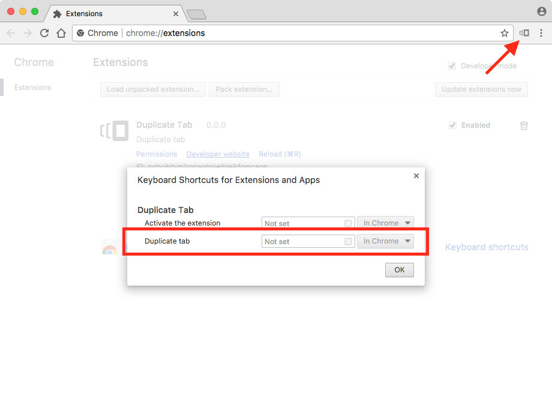

Duplicate Tab
=============

Chrome extension to duplicate the current tab.

## Usage

* Click the "Duplicate tab" icon from the Google Chrome toolbar.

* From "Window" -> "Extensions" -> ["Keyboard shortcuts"](chrome://extensions/configureCommands), set a shortcut for "Duplicate tab".

## Performance

Consumes minimal resources:

  * Uses a Manifest V3 short-lived light-weight [service worker](https://developer.chrome.com/docs/extensions/develop/concepts/service-workers/lifecycle#idle-shutdown) that only responds to narrow events.
  * Does not collect analytics.

## Third Party Notices

Icon is "[versions](https://octicons.github.com/icon/versions/)" from GitHub's [Octicons](https://octicons.github.com/), rasterized with http://fa2png.io/r/octicons/versions/.
